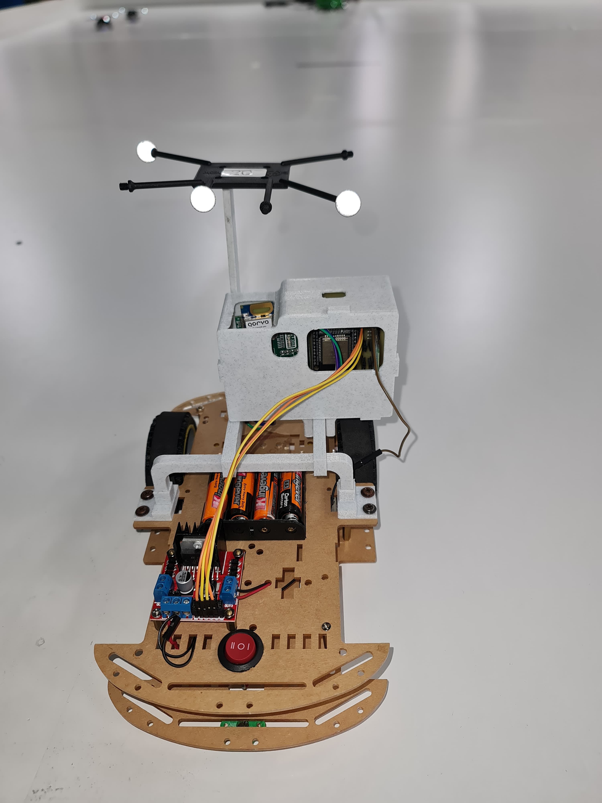
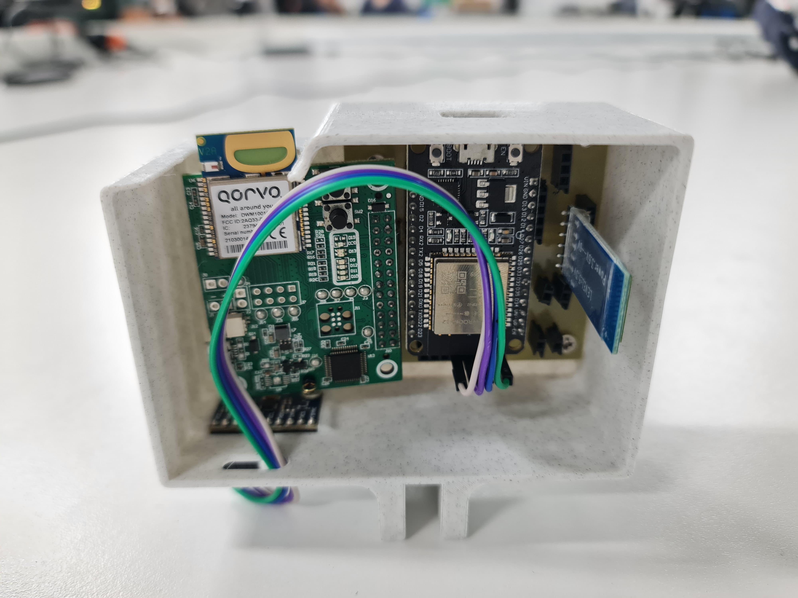
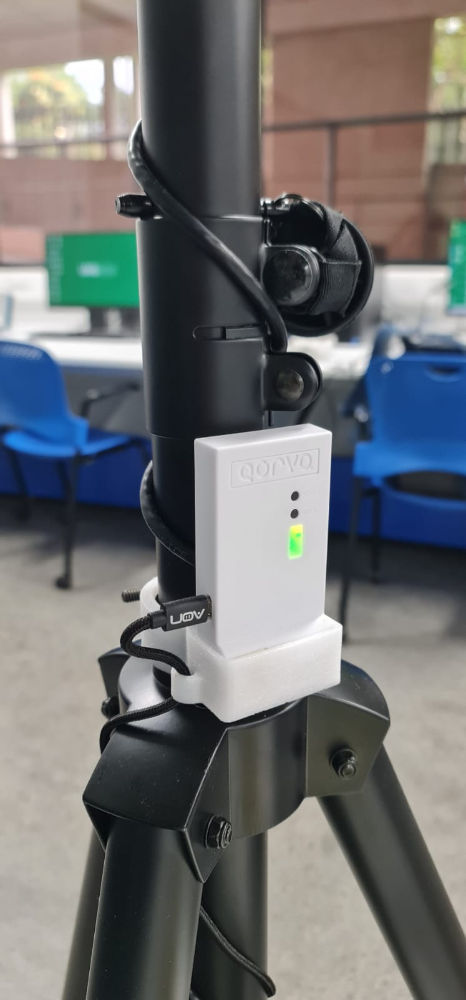
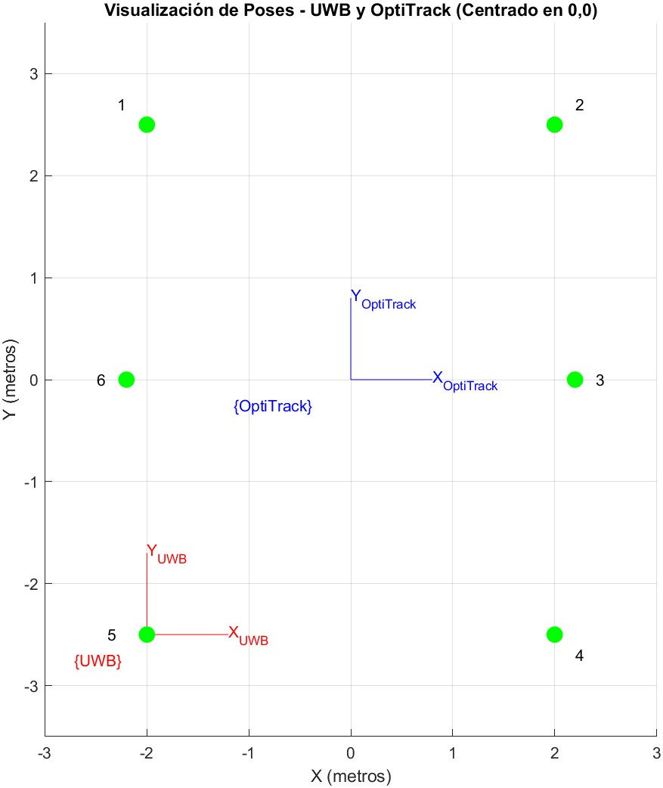

### Implementación en Tiempo Real

  

### Video Introductorio

Este video es un resumen de lo que trata el trabajo de graduación.
[Ver](https://youtu.be/SS0Pc4WxvF4)

### Descripción

Este repositorio es producto del trabajo de graduación titulado "Evaluación de Módulos Ultra Wide Band (UWB) para Sistemas de Navegación Local" en el cual se busca resolver la problemática de la navegación que consiste en localización en 2D. Los módulos UWB (MDEK1001) de la empresa Qorvo son útiles para montar un sistema de localización, sin embargo la localización tiene precisión de +/- 100 mm y carecen de orientación. Haciendo uso de fusión de sensores de módulos MDEK1001 con una unidad de medición inercial (IMU) MPU9250 de 9 DOF, se mejora la precisión de los módulos por debajo de +/- 25 mm con filtros complementarios. La exactitud se mejora haciendo uso de un sistema de captura de movimiento Optitrack, en donde se toman puntos en paralelo del sistema UWB y Optitrack con la finalidad de corresponder puntos y hacer transormación por medio de Homografía proyectiva. Este estudio encontró porcentajes de error bajos alrededor de 5.5% de error en los ejes X y Y. Se realizaron pruebas dinámicas con trayectorias en paralelo UWB con Optitrack obteniendo R^2 superiores a 0.9 para ambos filtros complementarios. Dados los resultados se empleó una visualización en tiempo real con PyGame mediante Wi-Fi TCP. Adicional a los objetivos se agregó orientación al Módulo de Navegación (Fusión UWB con MPU9250 por medio de un DOIT Devkit V1 ESP32)

### Elementos usados

- DOIT Devkit V1 ESP32
- MPU9250
- MDEK1001 (Kit de 12 sensores o más)
- Placa PCB fabricada para colocar elementos
- Carro de pruebas para mantener LOS (Line of Sight)
- Sistema de captura Optitrack

### Características Principales

- Ejecución en tiempo real de fusión de sensores como DWM1001 (UWB), MPU9250 (IMU), utilizando un DOIT DevKit V1 ESP32.
- Fusión de sensores con filtros complementarios.
- Aplicación de homografía proyectiva para calibración y mapeo de un sistema de coordenadas UWB a un sistema de captura de cámaras Optitrack.

### Uso de Carpetas y archivos importantes

¿Para qué se usan los distintos lenguajes de programación?

- C++ -> Se utilizó en la IDE de ARDUINO para programar el ESP32 y obtener datos crudos de posición del MDEK1001 y el MPU9250 así como el control del carro.
- Python -> Se utilizó para obtención de datos mediante Wi-Fi TCP, generación de archivos .CSV de datos crudos, procesamiento y graficación en tiempo real.
- MATLAB -> Se utilizó para obtención de estadísticas y plots para validar el uso de filtro complementarios y homografía proyectiva.

Se muestra el siguiente diagrama de arquitectura de obtención y procesamiento de datos.

  

| Carpeta  | Descripción |
| ------------- | ------------- |
| Archivos-CAD | Contiene enclosure de MDEK1001 y piezas para ensamblaje de carro de pruebas, esto incluye todos los elementos como módulos o placas PCB utilizadas  |
| Códigos-ARDUINO  | Contiene iteraciones de código para lograr la obtención de datos crudos y envío de los mismos. |
| Códigos-MATLAB | En esta carpeta se debe usar "DYNAMIC_Plotting_ButterWorth_POS.m", "DYNAMIC_Plotting_CompFilt_POS.m" y "Homografia.m" el resto son funciones correspondientes a obtención de datos de Optitrack y archivos de datos donde se guardaron variables de homografía. Este código trabaja con la generación de .CSV de python correspondiente a la versión "3_UWB_OPTI_DATAFETCH.py". |
| Codigos-PYTHON | Esta carpeta contiene versiones de captura de datos mediante Wi-Fi TCP, se recomienda utilizar la V0.3 para obtención de datos crudos, V0.4 para visualización en tiempo real con filtro complementario normal y aplicación de homografía |
| Datasets | Se tienen las carpetas de datasets estáticos (calibración) y dinámicos. Estos datos se pueden utilizar para analizarlos utilizando los códigos de MATLAB o algún otro programa de análisis de datos. Allí se encuentran trayectorias, puntos correspondientes, etc. Se obtienen con la V0.3 o "3_UWB_OPTI_DATAFETCH.py". |
| Documentos-Referencias | Documentos académicos utilizados y hojas de datos. |
| Fotos | Fotos para README. |
| GIFs | Gifs para README. |
| PCB | Archivos gerber para realizar PCB, también se encuentra información en la sección de links para más detalles. |
| PROTOCOLO | Protocolo de Trabajo de Graduación. |

### Carro de Pruebas

Este carro ayuda a mantener las condiciones de línea de vista y facilita el proceso de calibración y obtención de datos al ser manejado de manera remota. Para ello en el módulo de navegación se colocó un HC05 para enviar comandos. La idea fue reservar la antena del ESP32 exclusivamente para envío de datos mediante Wi-Fi TCP y de manera alterna controlar el carro con una antena USB como el HC05. La ventaja es que no es del todo necesario y el módulo de navegación se puede instalar en cualquier dispositivo móvil que lo use.

  

### PCB y Módulo de Navegación

  <table>
    <tr>
      <td align="center">
        
        
PCB fabricación y diseño

      </td>
      <td align="center">
        
        
Módulo de Navegación

      </td>
    </tr>
  </table>

Nota: durante el trabajo se cambió el MPU9250 GY-91 de 10DOF al MPU9250 con 9DOF por fallo de Hardware, sin embargo el integrado sigue siendo el mismo.

### Montaje de sensores MDEK1001 configurados como ancla

Disposición de sensores

  

  <table>
    <tr>
      <td align="center">
        
        
Montaje en trípode

      </td>
      <td align="center">
        
        
Orden de Montaje y Sistemas de coordenadas

      </td>
    </tr>
  </table>

### Links

- [PCB](https://oshwlab.com/mel20310/uwb_mpu9250_esp32_integration)

- [Playlist Youtube](https://www.youtube.com/playlist?list=PLJCfE4ERlMfTEnHDD8o-vjXzkgCI-jniX)

